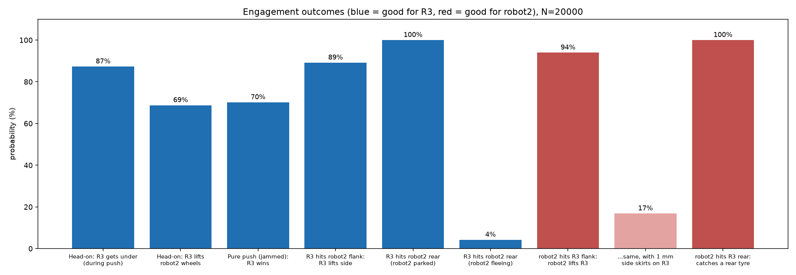
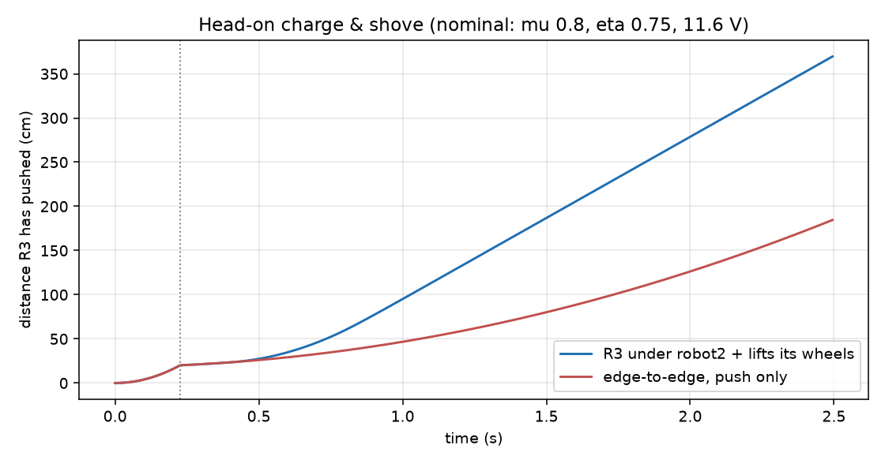

# จำลองการปะทะ: robot2 (V2) vs ROBOT_V3 R3 — 25 ก.ย. 2026

**ประเภทการจำลอง:** reduced-order model + Monte Carlo 20,000 รอบ (seed 20260925) ไม่ใช่ 3D contact/FEA และไม่มีคนขับจริง. สร้างซ้ำได้ด้วย `python3 duel_sim.py` ผลดิบอยู่ใน `results.json` และ `mc_samples.csv`.

## ข้อสรุป

- **R3 ได้เปรียบเมื่อได้เข้าชนด้วยด้านหน้าของตัวเอง** (ชนหน้า, ชนข้าง robot2, ชนท้าย robot2 ตอนจอด): มุดใต้ได้ 87–100% และแรงยกเกินที่ต้องใช้ ≥8 เท่า. ถ้ายกล้อ robot2 พ้นพื้น robot2 จะไม่มีแรงขับเหลือ.
- **robot2 ได้เปรียบเมื่อเข้าข้างหรือท้าย R3:** ใบตัก robot2 มุดใต้ยาง/การ์ดข้างของ R3 ได้ 94% และยกข้าง R3 ได้.
- **ดันล้วน (ขอบชนขอบ) ค่อนข้างสูสี: R3 ชนะ 70%** เพราะหนักกว่า ทั้งสองคันถูกจำกัดด้วยแรงเสียดทานล้อ ไม่ใช่กำลังมอเตอร์.
- **robot2 เลี้ยวเร็วกว่า ~2 เท่า** (90° ใน 0.18 วินาที เทียบกับ 0.39 วินาที) จึงมีโอกาสอ้อมไปข้าง R3 ได้ ซึ่งเป็นจุดอ่อนของ R3.
- **ผู้ชนะขึ้นกับว่าใครได้มุมชนที่ต้องการ.** แบบจำลองนี้ไม่ได้ให้เปอร์เซ็นต์ชนะรวม เพราะต้องสมมติน้ำหนักของแต่ละสถานการณ์ (ขึ้นกับคนขับ).
- **ถ้า R3 ใส่แผ่นกันข้างสูง 1 มม. (skirt) ครบทั้งด้านข้างและท้าย** โอกาสที่ robot2 มุดใต้ข้าง R3 ลดจาก 94% เหลือ 17%. เมื่อแก้แล้ว R3 จะได้เปรียบชัดเกือบทุกสถานการณ์.

## ข้อมูลตั้งต้น (จาก Fusion + ผู้ผลิต)

| รายการ | robot2 | R3 |
|---|---|---|
| มวล (แทนชิ้นซื้อด้วยมวลผู้ผลิต + แบต 80 g + สาย 30 g เท่ากัน) | **1.087 kg** | **1.237 kg** (รวมแท่น/ฮับมอเตอร์ 27.9 g ×4 และล้อ 26.2 g เท่า robot2) |
| จุดศูนย์ถ่วง | หน้าเพลาเพียง **0.5 มม.** (± ไม่แน่นอน 5 มม.), สูง 30.5 มม. | y 14.7 มม. (ระหว่างเพลา 58/−60), สูง 14.7 มม. |
| ขับ | 2 × BBB 22 mm, 1 ตัว/ช่อง ESC | 4 × BBB 22 mm, 2 ตัว/ช่อง (จำกัด 8 A) |
| แรงดันสูงสุดจากมอเตอร์ (มัธยฐาน) | 33 N | 63 N |
| แรงดันจริงที่จำกัดด้วยล้อ (มัธยฐาน) | **8.5 N** | **9.6 N** |
| ความเร็วสูงสุด (11.1 V) | 1.8 m/s | 1.8 m/s |
| ขอบหน้า | ใบตักกลาง 62 มม.; ลิ่มข้าง + ขอบแผ่นฐานกว้าง 160 มม. | ขอบเหล็ก 168 มม. สูง 0.5–1.5 มม. จากพื้น |

ค่าคงที่มอเตอร์ **ประมาณจาก** 4.3 A stall, 0.3 A / 890 rpm no-load ที่ 12 V (ผู้ผลิตไม่ให้แรงบิด stall) และกวาดประสิทธิภาพเกียร์ 0.6–0.9.

### ท่ายืนของ robot2 (สำคัญที่สุด)

robot2 มีล้อกลางตัวและจุดศูนย์ถ่วงแทบอยู่บนเพลา จึง **โยกหน้า-หลังตามคันเร่ง:**

| สถานะ | ปลายใบตัก | ขอบหน้าฐาน | ขอบท้ายฐาน |
|---|---:|---:|---:|
| ตั้งตรง (ค่าใน CAD) | 5.8 มม. | 3.0 | 3.0 |
| **หน้าคว่ำ** (จอด, เบรก, ขณะกระแทก) | **2.1 มม.** | 0 (แตะพื้น) | 6.0 |
| **หน้าเงย** (เร่ง, กำลังดัน) | **9.5 มม.** | 6.0 | 0 (แตะพื้น) |

**แก้ข้อมูลเดิม:** ที่เคยรายงานว่า R3 มุดใต้ใบตัก robot2 ได้ 4.3 มม. คิดจากท่าตั้งตรง. ความจริงคือ **ขณะกระแทก เหลือ 0.6 มม.** และ **ขณะ robot2 ดัน ได้ 8 มม.**

## ผลแต่ละสถานการณ์

### 1. ชนหน้า (head-on)
- **ขณะกระแทก:** robot2 หน้าคว่ำ R3 มุดใต้ใบตักได้ **65%** (เผื่อความคลาดของความสูงขอบ ±0.7 มม.). ช่วงลิ่มข้างของ robot2 ขอบแผ่นฐานแตะพื้น R3 จึงมุดไม่ได้ กลายเป็นขอบชนขอบ.
- **เมื่อ robot2 ดันต่อ:** ตัวเงยหน้า ใบตักยกขึ้นเป็น 9.5 มม. R3 มุดใต้ได้รวม **87%**.
- **เมื่อมุดได้แล้ว R3 ยก:**
  - ต้องยกให้ปลายใบตัก robot2 สูงขึ้น 14.2 มม. (robot2 โยกลงแท่นท้าย แล้วล้อลอย 3 มม.). R3 ทำได้มัธยฐาน 19.8 มม.
  - แรงที่ต้องใช้ 4.8 N ส่วน R3 ให้ได้ ≥39 N แม้ที่มุมอ่อนสุดและเซอร์โวให้แรงแค่ 50%
  - **R3 ยกล้อ robot2 พ้นพื้นได้ 69%**
- **ถ้าไม่ได้ยก แต่ R3 มุดอยู่ใต้:** น้ำหนักของ robot2 ถ่ายมาที่ R3 **R3 ดันชนะ 100%.**
- **ถ้าขอบชนขอบ:** R3 ดันชนะ 70%.
- **รวม: R3 คุมสถานการณ์ชนหน้าได้ 96%.**
- **ปัจจัยที่พลิกผลได้มากสุด** (ดู `sensitivity.png`): ตำแหน่งจุดศูนย์ถ่วง robot2 (ยิ่งอยู่หน้า robot2 ยิ่งหน้าคว่ำ ใบตักยิ่งต่ำ), แรงเสียดทานยาง, และความสูงปลาย R3 ตอนประกอบจริง.

- **จำลองตามเวลา** (ค่ากลาง: μ 0.8, η 0.75, 11.6 V, เริ่มห่าง 40 ซม.):
  - ชนกันที่ 0.23 วินาที ด้วยความเร็วเข้าหากัน **3.4 m/s**
  - ถ้ายกได้ R3 ดัน robot2 ไป 1 เมตรในเวลาราว 1 วินาทีหลังชน
  - ถ้าดันล้วน ดันได้ช้ากว่าราวครึ่งหนึ่ง

### 2. R3 ชนข้าง robot2
- ขอบข้างของ robot2 สูง 0–6 มม. (ท่าหน้าคว่ำ) และยางอยู่ชิดข้างตัว.
- R3 มุดใต้ได้ **89%** (59% โดนตรงยาง).
- ยกข้างได้ทุกครั้งที่มุดได้ เพราะใช้แรงแค่ ~5 N.
- เมื่อล้อ robot2 ฝั่งใกล้ลอย robot2 เหลือล้อขับล้อเดียว หมุนได้แต่หนีไม่ได้.

### 3. robot2 ชนข้าง R3 — **จุดอ่อนหลักของ R3**
- **การ์ดข้างของ R3 ลอยจากพื้น 6 มม.** ใบตัก robot2 ตอนกระแทก (2.1 มม.) จึงมุดใต้การ์ดได้.
- **ยางหน้า-หลังของ R3 เปิดโล่งที่มุม.** ใบตักที่ต่ำกว่าแกนล้อ (21 มม.) จะงัดใต้ยางกลมได้แม้ตอนหน้าเงย 9.5 มม.
- **robot2 มุดใต้ได้ 94%** และยกข้าง R3 ได้ (แรงยกของ robot2 ประมาณ 30–150 N เพราะก้านต่อใน CAD ยังไม่ได้แก้สมการ ส่วนที่ต้องใช้ ~6 N).
- **ถ้าใส่ skirt 1 มม. คลุมทั้งด้านข้าง** เหลือ **17%** (เกิดจากความคลาดความสูงเท่านั้น).

### 4. ชนท้าย
- **R3 → ท้าย robot2:**
  - robot2 จอดอยู่ (ท้ายยก 6 มม.): มุดใต้ได้ 100% ยกท้าย 6 มม. ล้อ robot2 ลอย 3 มม. **robot2 ติดตาย**
  - robot2 กำลังหนี (ท้ายแตะพื้น): มุดได้ 4% กลายเป็นการดันไล่
- **robot2 → ท้าย R3:**
  - คานท้ายของ R3 ลอยจากพื้นแค่ 1 มม. จึงไม่โดนมุด
  - แต่ **ยางหลังเปิดที่มุม** และหน้า robot2 กว้าง 160 มม. จึงงัดยางหลังได้ทุกครั้งที่ชนตรงท้าย

### 5. พลิก / คว่ำ
- **ไม่มีฝ่ายไหนพลิกอีกฝ่ายได้:**
  - พลิก robot2 ข้างต้องเอียง 69° คือยกขอบข้าง ~150 มม. ขณะที่ R3 ยกได้ 36 มม.
  - พลิก R3 ต้องเอียง 80°
- **R3 วิ่งกลับหัวได้** (ยางสูงกว่าฝา 5 มม.) แต่อาวุธจะใช้ไม่ได้.
- **robot2 วิ่งกลับหัวไม่ได้** (ตัวสูง 85 มม. ล้อ 42 มม.) ถ้าถูกดันชนผนังจนล้ม จะแพ้ทันที.

### 6. แรงกระแทก (เตือน ไม่ใช่ผลรับรอง)
- ชนกันที่ 3.4 m/s ถ้าปรับสเกลแบบเส้นตรงจากแบบจำลองเดิม (583 N ที่ 0.5 m/s) จะได้ **~4 kN** — เป็นแค่ลำดับขนาด.
- แบบจำลองแรงชนเดิมคำนวณแค่แผ่นเดียว **ยังไม่ได้ตรวจความแข็งแรงของหมุดแกน Ø6 ของลิ่ม, น็อต M3 ของปีก และใบตัก robot2 ที่ความเร็วนี้.**

## ต้องแก้/ปรับปรุง — R3 (เรียงตามผลกระทบ)

1. **ใส่ skirt ข้างสูง 1 มม. จากพื้นให้ครบทั้งสองข้าง และคลุมยาง** (แทนการ์ดข้างเดิม 6 มม.) + **ใส่การ์ดมุมท้ายบังยางหลัง.** ลดโอกาสถูกยกข้างจาก 94% เป็น 17%.
2. **ชดเชยการเลี้ยวที่ช้ากว่า:** ขับแบบหันหน้าเข้าหาเสมอ. ทางเลือกด้านแบบ: ทำ skirt/ขอบข้างเป็นลิ่มด้วย เพื่อให้ถูกชนข้างแล้วไม่เสียเปรียบ.
3. **คุมความสูงปลายหลังประกอบจริง ≤1.5 มม.:** เป็นตัวแปรอันดับต้นของผลชนหน้า. ถ้าปลายสูงขึ้นแค่ 1 มม. โอกาสมุดตอนกระแทกจะลดลงชัดเจน.
4. **ตรวจความแข็งแรงที่ชน 3.4 m/s:** หมุดแกน Ø6, รูแกนในปีก (ผนัง 1.5 มม.), น็อต M3 ×4, คลีวิสก้านดัน — ต้องทำ 3D FEA/ทดสอบจริง.
5. **ใช้ยางเนื้อนิ่มแรงเสียดทานสูง:** μ เป็นตัวแปรอันดับ 1 ของการดัน. ใช้ยางเดียวกับที่จะเจอพื้นสนามจริงแล้ววัด μ.
6. เก็บน้ำหนักไว้ (หนักกว่าช่วยการดัน) แต่ต้องชั่งจริง. ค่า 1.24 kg ยังเป็นค่าประมาณ.

## จุดอ่อนของ robot2 (ถ้าต้องปรับ robot2 ด้วย)
- จุดศูนย์ถ่วงอยู่บนเพลาพอดี ทำให้หน้าเงยเวลาดันและใบตักยกเอง → **ย้ายน้ำหนักไปหน้า** (แบต/ESC) ให้หน้าคว่ำแน่นอน ใบตักอยู่ต่ำตลอด.
- ใช้ยาง ABS ตาม CAD (μ ~0.4) จะแพ้การดัน 100% → ต้องใช้ยางยาง.
- วิ่งกลับหัวไม่ได้และตัวสูง 85 มม. → ถ้าถูกดันชนผนังจนล้มคือแพ้.

## ข้อจำกัดของแบบจำลอง
- **ไม่ใช่การจำลองแบบฟิสิกส์ 3D.** ความสูงขอบ ท่ายืน แรงเสียดทาน และการถ่ายน้ำหนักเป็นแบบกึ่งสถิต. ไม่มีการเด้ง การบิด ฝุ่น พื้นเอียง หรือความเร็วตอนเลี้ยว.
- **แรงยกของ robot2 ใช้ช่วงสมมติ 30–150 N** เพราะก้านต่อยังไม่ได้แก้สมการ.
- **ความคลาดความสูง ±0.7 มม. เป็นค่าสมมติ.** ต้องวัดความสูงขอบของทั้งสองคันบนพื้นสนามจริง.
- **ไม่มีกติกา/สนาม:** ใช้ "ยกล้อพ้นพื้น" และ "ดันชนะ" แทนเงื่อนไขชนะ.
- ความน่าจะเป็นต่อสถานการณ์ **ไม่ได้รวมเป็นเปอร์เซ็นต์ชนะทั้งแมตช์** เพราะขึ้นกับคนขับ.
