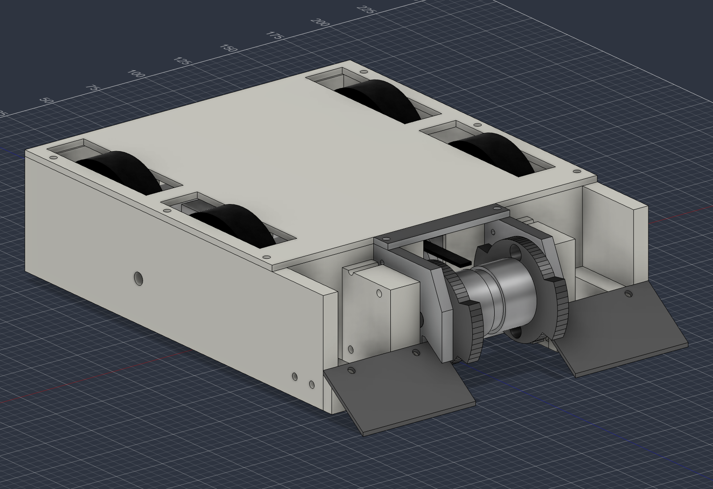

# ROBOT V4 — beater แนวตั้ง (สถานะ 3 ต.ค. 2026)

**สถานะ:** CAD, การคำนวณคัดกรอง และเฟิร์มแวร์ร่างเสร็จแล้ว แต่ยังไม่ผ่านเกณฑ์ผลิต ยังไม่ได้ซื้ออะไหล่ และยังไม่ได้ compile เฟิร์มแวร์
ราคาและแหล่งที่มาเพิ่มเติมอยู่ใน [`V4_Plan.md`](V4_Plan.md) (ตัวเลขน้ำหนักในไฟล์นั้นเป็นค่าเก่า ให้ใช้ตัวเลขในไฟล์นี้แทน)

กติกา (จากผู้ใช้ 2 ต.ค.): งบ 5,000–6,000 บาท · น้ำหนัก 1–2 กก. · อาวุธทุกชนิด · พื้นพลาสติก/กระเบื้อง

## ไฟล์

| ไฟล์ | เนื้อหา |
|---|---|
| `ROBOT_V4_Beater.f3d` / `.step` | CAD สร้างจาก `build_robot_v4.py` (แนวคิด: Z ขึ้น หน้า +Y; ในไฟล์ Fusion: Y ขึ้น หน้า −Z) |
| `V4_View.png` | ภาพมุมหน้า-ขวา (`capture_v4_view.py`) |
| `design_v4.py` → `v4_design.json` | พลังงานอาวุธ, เวลาเร่งรอบ, ramp ของเฟิร์มแวร์, ไจโร, bite, แรงขับ, มวล, ตรวจแกน |
| `matchup_screen.py` → `matchup_results.json` | คัดกรองคู่ต่อสู้ 6 แบบ (สุ่ม 50,000 รอบ) โดยใช้ความสูงขอบหน้าของ V4 แต่ละช่วงจาก CAD |
| `manufacturing/` | **ไฟล์ผลิต:** DXF 5 ชิ้น (ตัดเลเซอร์), STL 6 ชิ้น (พิมพ์ 3D), รายละเอียดชิ้นกลึง — อ่าน [`manufacturing/README.md`](manufacturing/README.md) |
| `firmware/pad_test/pad_test.ino` | ทดสอบจอยกับ ESP32 เปล่า: จับคู่ได้ไหม และส่งข้อมูลต่อเนื่องตอนถือคันโยกนิ่งไหม (ทำก่อนซื้ออย่างอื่น) |
| `firmware/v4_controller/v4_controller.ino` | ESP32 + จอยบลูทูธ (Bluepad32): failsafe, การ arm, ramp อาวุธ, โหมดกลับหัว |

## แบบ

- **อาวุธ**
  - beater แนวตั้ง: จานเหล็ก 4140/Hardox 2 แผ่น หนา 6 มม. (ปลายฟัน Ø59, ฐาน Ø46, ฟัน 2 ซี่ กว้างซี่ละ 60°, รูกลาง Ø14) ขันด้วย M3 หัวจมข้างละ 4 ตัวเข้าดุมอะลูมิเนียม Ø30/22 ที่มีร่องสายพานตรงกลาง
  - หมุนบนลูกปืน 608 สองตัว (อัดอยู่ในดุม และจานช่วยกันหลุด) รอบแกนตาย M8 **เกรด 12.9** ที่ยึดระหว่างแผ่นตั้ง 6061 หนา 6 มม. แต่ละแผ่นตั้งยึดเข้ากับบล็อกในตัวถังด้วย M3×20 สี่ตัว ขันจากด้านในตัวรถผ่านบล็อกเข้าเกลียวที่ต๊าปในแผ่นตั้ง (ไม่ใช้ insert ใน TPU); แหวนรองแกน 6061 สามตัวล็อกโรเตอร์ไม่ให้เลื่อนตามแกน และมี brace บน/ล่างยึดสองแผ่นเข้าหากัน
  - ขับด้วย**สายพานกลม PU 5 มม. อัตรา 1:1** จากมอเตอร์ D3536 1250kV สายพานจะลื่นเมื่อโดนกระแทก ช่วยจำกัดแรงบิดและกระแสหลังการชน
  - ปลายฟันห่างจากพื้น 2.5 มม.
- **wedgelet**
  - เหล็กหนา 2 มม. ปลายสูง 0.5 มม. จากพื้น
  - กว้างคลุมหน้าทั้งหมดยกเว้นช่องใบ (x ±27…88) วิ่งลอดใต้แผ่นตั้งและผนังข้าง แผ่นตั้งถูกตัดให้ห่างจากแนวลาดอย่างน้อย 1 มม.
- **ตัวถัง**
  - พิมพ์ด้วย TPU เป็นถาดชิ้นเดียว + ฝา (ยึดด้วย M3 หกตัวเข้า heat-set insert) ขนาดรวม 176 × 238 × 64 มม. (รวมใบและ wedgelet)
  - wedgelet ขันด้วย M3 หัวจมเข้า heat-set insert ใน**บล็อก PETG แยก** (ไม่ใช่ TPU) บล็อกดันชน bulkhead และยึดผนังข้างด้วย M3 แนวนอนสองตัว
  - ล้อ Ø64 ยื่นพ้นตัวถังทั้งบนและล่าง จึง**ขับกลับหัวได้**
- **ระบบขับ:** 4WD มอเตอร์ JGA25-370 400 rpm (ยึดกับผนังในตัวถัง) ระยะระหว่างเพลาหน้า-หลัง 80 มม. ระยะระหว่างล้อซ้าย-ขวา 140 มม. ล้อเป็นดุม PETG + ยาง TPU รูกลางรูป D
- **ตรวจใน Fusion (42 bodies)**
  - ชิ้นส่วนชนกัน (interference) **0 จุด**
  - ทดสอบวงหมุนของใบโดยเผื่อเพิ่ม 1 มม.: ไม่โดนชิ้นอื่น
  - สายพานวิ่งผ่านระหว่างจานทั้งสองตามที่ตั้งใจ

## ผลคำนวณ (`v4_design.json`)

| รายการ | ค่า |
|---|---|
| มวลโรเตอร์ | 230 กรัม (จาน 80 × 2 + ดุม 32 + ลูกปืน/สกรู; ตรงกับ CAD 229 กรัม) |
| รอบใช้งาน (3S, 90% ของรอบตัวเปล่า) | 12,400 rpm ความเร็วปลายฟัน 38 m/s |
| พลังงานสะสม | **≈57 J** |
| เวลาเร่งรอบตามเฟิร์มแวร์ (ramp 1,600 µs/s) | **0.64 วินาที** ถึง 90% กระแสสูงสุดประมาณ 29 A |
| กระแสหลังโดนชนจนรอบเหลือครึ่งหนึ่ง ขณะคันเร่งเต็ม | **≈110 A ชั่วขณะ** (ESC ไม่มีตัวจำกัดกระแส; สายพานที่ลื่นช่วยลดลงได้ ต้องวัดจริง) |
| อัตราเลี้ยวสูงสุดก่อนไจโรยกล้อข้างหนึ่ง | 14.7 rad/s |
| bite ที่ความเร็วเข้าหากัน 2 m/s | 4.8 มม. (ฟันยื่นออกมา 6.5 มม.) |
| ความเร็วขับ / แรงดัน | 1.24 m/s / 6–12 N (ถูกจำกัดด้วยการยึดเกาะ μ 0.4–0.8) |
| **มวลรวมประมาณ** | **1,888 กรัม** เหลือเผื่อ 112 กรัมก่อนชนเพดาน 2 กก. |

**ที่มาของมวล:** ตัวถัง ล้อ แผ่นตั้ง brace wedgelet และโรเตอร์ ใช้ค่าจาก Fusion; ตัวถัง TPU คิดที่ 85% ของเนื้อตัน (ผนัง 4 ชั้น + infill 60%) ดุมล้อและบล็อก PETG คิดที่ 80% ซึ่ง**เป็นค่าสมมติ ต้องชั่งชิ้นที่พิมพ์จริง**; มอเตอร์ 110 กรัม/ตัวตาม datasheet; แบตและ ESC ยังเป็นค่าประมาณ
**เพิ่มน้ำหนักอาวุธไม่ได้อีก:** ถ้าใช้จานหนา 8 มม. (75 J) มวลรวมจะเกิน 1,900 กรัม

**จุดที่ต้องระวัง**
- **แกน M8:** ถ้าสมมติว่าการชนเกิดภายใน 1 ms แรงจะอยู่ราว 8.5 kN ทำให้เกิดความเค้นดัด 674 MPa ซึ่ง**เกินเกรด 8.8** (ครากที่ 640 MPa) จึงต้องใช้เกรด 12.9 (1,080 MPa)
- **ลูกปืน 608** จะรับแรงเกินพิกัดสถิตประมาณ 3 เท่า ให้ถือเป็นของสิ้นเปลืองและเตรียมสำรองไว้
- **ESC Skywalker หมุนได้ทางเดียว** เวลาหุ่นกลับหัว ใบจะตีลงแทนตีขึ้น ถ้าต้องการให้ตีขึ้นได้ทั้งสองด้าน ต้องเปลี่ยนเป็น ESC ที่มีโหมด 3D (BLHeli_S/AM32)

## คัดกรองคู่ต่อสู้ (`matchup_results.json`)

**วิธีคิด:** V4 มีขอบหน้า 3 ช่วง คือช่องใบ (|x|<26 มม.) สูง 2.5 มม. และ wedgelet สองข้างสูง 0.5–1.5 มม. แต่ละรอบสุ่มให้คู่ต่อสู้เข้าชนเยื้องศูนย์ ±60 มม.

| คู่ต่อสู้ | ใบโดนคู่ต่อสู้ | wedgelet V4 มุดใต้ได้ | คู่ต่อสู้มุดใต้ V4 ได้บางจุด | ตีโดนแบบคู่ต่อสู้ไม่ได้มุด | ดันชนะ | หมายเหตุ |
|---|---:|---:|---:|---:|---:|---|
| V2 robot2 | 100% | 83% | 92% | 8% | 63% | ลิ่มข้างของ V2 แตะพื้น (0 มม.) ขณะกระแทก จึงมุดใต้ wedgelet ได้ แต่ใบตีใบตักตรงกลางของ V2 ในจังหวะเดียวกัน ถ้าตีโดนคาดว่าลอยประมาณ 1.6 ม. และ V2 กลับหัวแล้ววิ่งไม่ได้ |
| R3 | 100% | 58% | 58% | 42% | 46% | ขอบต่ำพอๆ กัน จึงสูสี |
| ลิ่มต่ำทั่วไป | 100% | 74% | 36% | 64% | 42% | |
| ใบหมุนแนวนอน | 100% | 100% | 0% | 100% | 88% | แต่**พลังงานของ V4 สูงกว่าแค่ 16%** ของช่วงที่สมมติไว้ (40–150 J) |
| ใบหมุนแนวตั้ง | 100% | 96% | 43% | 57% | 77% | พลังงานของ V4 สูงกว่า 30% ของช่วง 30–120 J |
| หุ่นดัน/คุมเกม | 100% | 92% | 12% | 88% | **8%** | ต้องตีให้โดน ห้ามดันกัน |

**ข้อควรระวังในการอ่านผล**
- ตัวเลข "ใบโดนคู่ต่อสู้ 100%" มาจากการสมมติว่าเล็งพลาดไม่เกิน ±60 มม. และคู่ต่อสู้กว้าง 160 มม.
- ตัวเลขทั้งหมดบอกแค่ว่าในการปะทะครั้งแรก**ใครได้เปรียบ**ตรงไหน ไม่ใช่เปอร์เซ็นต์ชนะ
- **V4 ไม่ได้ชนะทุกแบบ** จุดอ่อนมี 3 ข้อ:
  1. พลังงาน 57 J ต่ำกว่าใบหมุนแรงๆ ในคลาสนี้
  2. แรงดันน้อยกว่าหุ่นดัน
  3. หุ่นที่ลิ่มต่ำมาก (R3, ลิ่มข้างของ V2) ยังมุดใต้ wedgelet ได้

## BOM (ราคาค้นเมื่อ 2–3 ต.ค., `≈` = ค่าประมาณหรือยังต้องขอใบเสนอราคา)

| รายการ | จำนวน | บาท | แหล่ง |
|---|---:|---:|---|
| ESP32 DevKit V1 | 1 | 200 | [ArtronShop](https://www.artronshop.co.th/product/95/doit-esp32-devkit-v1-%E0%B8%9A%E0%B8%AD%E0%B8%A3%E0%B9%8C%E0%B8%94%E0%B8%9E%E0%B8%B1%E0%B8%92%E0%B8%99%E0%B8%B2-esp32) (170–240) |
| จอยบลูทูธแบบ PS4 รุ่นเลียนแบบ (เลือกแล้ว 3 ต.ค.) | 1 | ≈350 | 279–388 บาท ([Priceza](https://www.priceza.com/s/%E0%B8%A3%E0%B8%B2%E0%B8%84%E0%B8%B2/%E0%B8%88%E0%B8%AD%E0%B8%A2-ps4)); Bluepad32 ระบุว่ามี clone บางรุ่นที่ใช้ได้ จึง**ต้องลองต่อกับ ESP32 ก่อนซื้ออย่างอื่น**; ถ้าใช้ไม่ได้ให้ใช้ DualShock 4 แท้มือสอง (~790) |
| iMAX B6AC | 1 | 559 | ราคาต่ำสุดที่พบ (559–1,498); [Cybertice](https://www.cybertice.com/product/3388/) 640 |
| แบต 3S 1000 mAh ≥50C | 1 | ≈600 | รุ่น 30C ราคา 500–620 ([UDSHOBBY](http://www.udshobby.com/category/27/battery-%E0%B8%AD%E0%B8%B8%E0%B8%9B%E0%B8%81%E0%B8%A3%E0%B8%93%E0%B9%8C/3s-11-1v)); ยังไม่เจอราคารุ่น 50C |
| D3536 1250kV | 1 | ≈560 | [BigGo](https://biggo.co.th/s/3536%20brushless%20motor) (466–1,080) |
| Hobbywing Skywalker 40A | 1 | 350 | [SrRcTech](http://www.srrctech.com/product/200/hbw-skywalker-esc-40a) |
| JGA25-370 12V 400 rpm | 4 | 760 | [FromFactory](https://www.fromfactory.net/product/6096/) 190/ตัว |
| DRV8871 | 2 | 200 | [ModuleMore](https://www.modulemore.com/en/product/1477/) 99/ตัว |
| ลูกปืน 608ZZ (2 + สำรอง 4) | 6 | 150 | [lnwdiy](http://www.lnwdiy.com/product/440/) / [hvrsp](https://hvrsp.co.th/product/%E0%B8%A5%E0%B8%B9%E0%B8%81%E0%B8%9B%E0%B8%B7%E0%B8%99-608-zz-ntn-8-x-22-x-7-mm-%E0%B8%A3%E0%B8%B2%E0%B8%84%E0%B8%B2-1-%E0%B8%95%E0%B8%A5%E0%B8%B1%E0%B8%9A-1400194/) 16–40/ตัว |
| สายพานกลม PU 5 มม. + รอกมอเตอร์ร่อง V | 1 ชุด | ≈150 | ยังไม่ได้ค้น (รอก GT2 สำเร็จรูปรูเพลาไม่ถึง 26 มม. จึงใช้กับท่อโรเตอร์ไม่ได้) |
| สกรู M3 หัวจมเตเปอร์ (จาน 8 ตัว + wedgelet 4 ตัว) | 2 ถุง | 90 | [B FAST](http://www.bfastshop.com/product/5312/) 45 บาท/ถุง (12 ตัว) |
| ชุดสกรู M3 หัวจม + น็อตล็อก (แผ่นตั้ง M3×20 แปดตัว, ฝาหกตัว, brace สี่ตัว, มอเตอร์) | 1 | 135 | ชุด 320 ชิ้นที่อ้างใน [V2 Budget Gate](../exports/V2_Budget_Gate_2026-09-24.md) |
| heat-set insert M3 (ฝา 6 + บล็อก PETG 8) | 1 ถุง | ≈150 | ยังไม่ได้ราคาไทย (ต่างประเทศ ~$11 ต่อ 100 ตัว) |
| สกรู M8×70 เกรด 12.9 + น็อตล็อก + สกรูตัวหนอน M3 | 1 ชุด | ≈50 | |
| ตัดเลเซอร์ + กลึง: DXF 5 ชิ้นใน `manufacturing/`, ดุม Ø30, รอกมอเตอร์, แหวนรองแกน 3 ตัว | 1 ชุด | ≈1,000 | ต้องขอใบเสนอราคา ([guenter](https://www.guenter.co.th/service/laser-cutting/) ไม่มีขั้นต่ำ) |
| เส้น TPU 95A 1 กก. (ตัวถัง + ล้อ) | 1 | 450 | [Elegoo TPU](https://www.sync-innovation.com/product/elegoo-tpu-filament/) |
| ดุมล้อ PETG 4 ชิ้น + บล็อก wedgelet 2 ชิ้น (ประมาณ 120 กรัม; ใช้เศษเส้นที่มี หรือจ้างพิมพ์) | 6 | ≈100 | |
| สายไฟ, XT30, ตัวตัดไฟ (removable link), ฟิวส์ | 1 ชุด | ≈250 | |
| ค่าส่ง | | ≈300 | |
| **รวม ถ้าซื้อทุกอย่าง** | | **≈6,400 — เกินเพดาน ~400** | อัปเดต 3 ต.ค. หลังเพิ่มสกรู, insert, แหวนรองแกน และดุมล้อ |
| **ผู้ใช้มี ESP32 และเครื่องชาร์จอยู่แล้ว (ยืนยัน 3 ต.ค.): ไม่ต้องซื้อ 2 รายการนี้ (−759)** | | **≈5,645** | **ไม่เกินงบ เหลือเผื่อ ≈355** |
| ถ้าซื้อ D3536 ร้านถูกสุด (466) + Skywalker ราคา 320 ด้วย | | ≈5,520 | |
| ถ้าจอยเลียนแบบใช้ไม่ได้ ต้องเปลี่ยนเป็น DualShock 4 แท้มือสอง | | +440 | |

**สรุปเรื่องงบ:** ผู้ใช้มี ESP32 และเครื่องชาร์จอยู่แล้ว ยอดที่ต้องจ่ายจริงจึงประมาณ **5,645 บาท ไม่เกินเพดาน 6,000** เหลือเผื่อประมาณ 355 บาท

ตัวเลขที่ยังไม่แน่นอนที่สุดคือค่าตัดเลเซอร์และกลึง (≈1,000) ถ้าใบเสนอราคาเกิน 1,350 บาท งบจะเกินเพดาน

ห้ามตัดสวิตช์ ฟิวส์ หรือ failsafe เพื่อประหยัดงบ และต้องทดสอบจอยกับ ESP32 ด้วย `pad_test.ino` ก่อนสั่งของอย่างอื่น

## เฟิร์มแวร์ — ต้องตรวจก่อนใช้

1. **ยังไม่ได้ compile** โค้ดใช้ API `ledcAttach`/`ledcWrite(pin, …)` ของ arduino-esp32 3.x ต้องยืนยันว่า board package ของ Bluepad32 ที่ติดตั้งใช้ core 3.x และใช้กับ ESP32Servo ได้
2. **สัญญาณอาวุธ:** หลังต่อ PWM ขับล้อ 20 kHz แล้ว ต้องวัดด้วยออสซิลโลสโคปหรือ logic analyzer ว่าขาอาวุธยังเป็น 50 Hz 1000–2000 µs เพราะช่อง LEDC ใช้ timer ร่วมกัน
3. **Failsafe ตัดเมื่อไม่ได้ข้อมูลใหม่ภายใน 250 ms:** ถ้าจอยส่งข้อมูลเฉพาะตอนมีการเปลี่ยนแปลง หุ่นจะหยุดและปลดอาวุธเองตอนที่คนขับถือคันโยกนิ่งๆ ต้องทดสอบกับจอยตัวที่จะใช้จริง

## แผนทดสอบก่อนแข่ง (ต้องทำครบ)

1. **ล็อกอาวุธ:** สอดหมุดผ่านแผ่นตั้งเข้าช่องในจานทุกครั้งที่หุ่นอยู่นอกสนาม
2. **Failsafe (ทำตอนถอดใบออก):**
   - ปิดจอยแล้ว ล้อและอาวุธต้องหยุดภายใน 0.25 วินาที
   - ถอดแบตจอยกลางทาง
   - เดินออกนอกระยะสัญญาณ
   - ถือคันโยกนิ่ง 10 วินาที แล้วหุ่นต้องไม่ตัดเอง (ข้อ 3 ของหัวข้อเฟิร์มแวร์)
3. **Arm:** ต้องกด L1+R1 ค้าง 1 วินาทีหลังเชื่อมต่อทุกครั้ง และปุ่ม B ต้องตัดอาวุธทันที
4. **อาวุธในกล่องปิด:**
   - วัดกระแสตอนเร่งรอบ (คาดไว้ประมาณ 29 A)
   - **วัดกระแสหลังใบถูกหยุดกะทันหันขณะคันเร่งเต็ม** (คาดไว้สูงถึงประมาณ 110 A ถ้าสายพานไม่ลื่น)
   - วัดอุณหภูมิมอเตอร์และ ESC
5. **ระบบขับ:** ดันจนมอเตอร์ติดตาย (stall) 10 วินาที แล้ววัดอุณหภูมิ DRV8871 และมอเตอร์
6. **ไจโร:** หมุนใบเต็มรอบแล้วเลี้ยว ดูว่าล้อลอยไหม ถ้าลอยให้ลดอัตราเลี้ยวในเฟิร์มแวร์
7. **น้ำหนักและความสูง:** ชั่งน้ำหนักจริงรวมแบต (ต้อง ≤ 2.0 กก.) และวัดความสูงปลาย wedgelet บนพื้นจริง (ต้องอยู่ที่ 0.5–1.5 มม.)
8. **หลังชนทุกครั้ง:** ตรวจแกน ลูกปืน สายพาน และน็อต

## ข้อจำกัด
- การคำนวณทั้งหมดเป็นแบบลดรูป **ไม่มี 3D FEA และไม่มีการจำลองฟิสิกส์ 3D**
- ค่าต่อไปนี้เป็นค่าสมมติ: R และ I0 ของมอเตอร์, ระยะเวลาชน 1 ms, สัดส่วนพลังงานที่ส่งไปคู่ต่อสู้ η, ระยะเล็งพลาด และช่วงพลังงานของคู่ต่อสู้
- ชิ้นส่วนที่ซื้อเป็นกล่องแทนขนาด (envelope) ต้องวัดของจริงก่อนพิมพ์และเจาะ
- เฟิร์มแวร์ยังไม่ได้ compile และยังไม่ได้ทดสอบกับบอร์ดจริง
